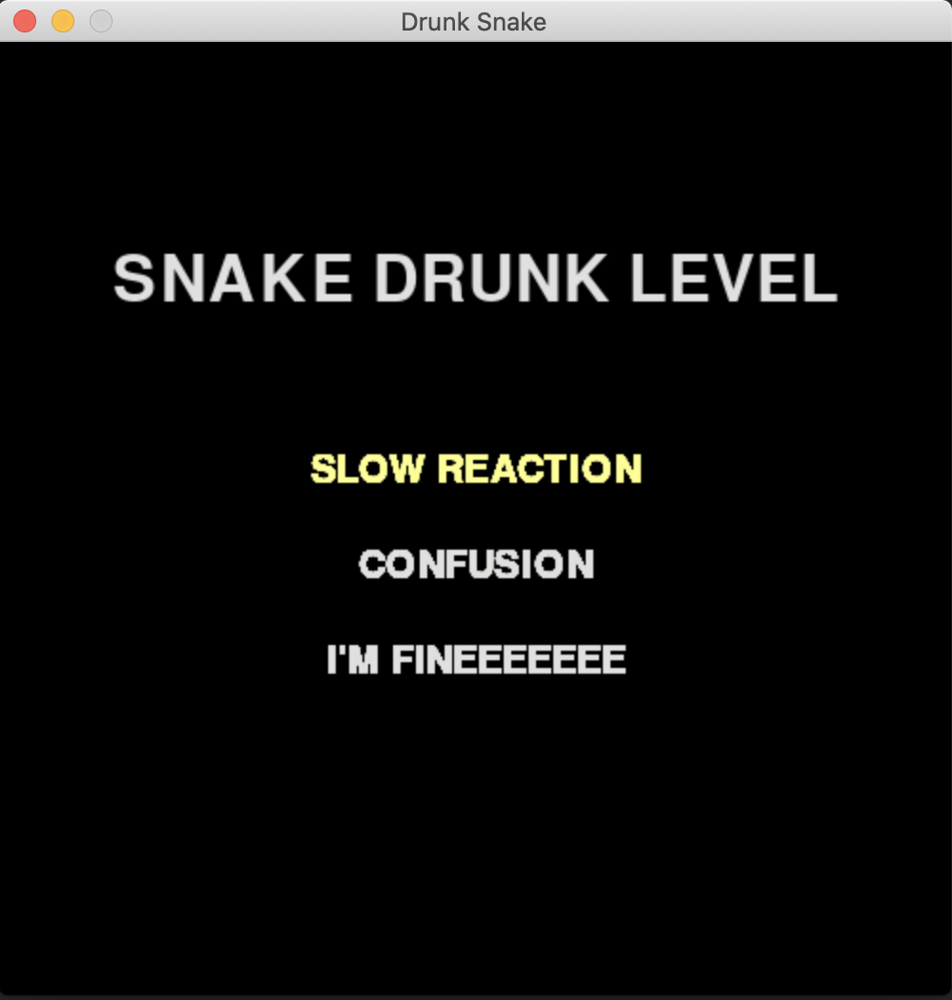
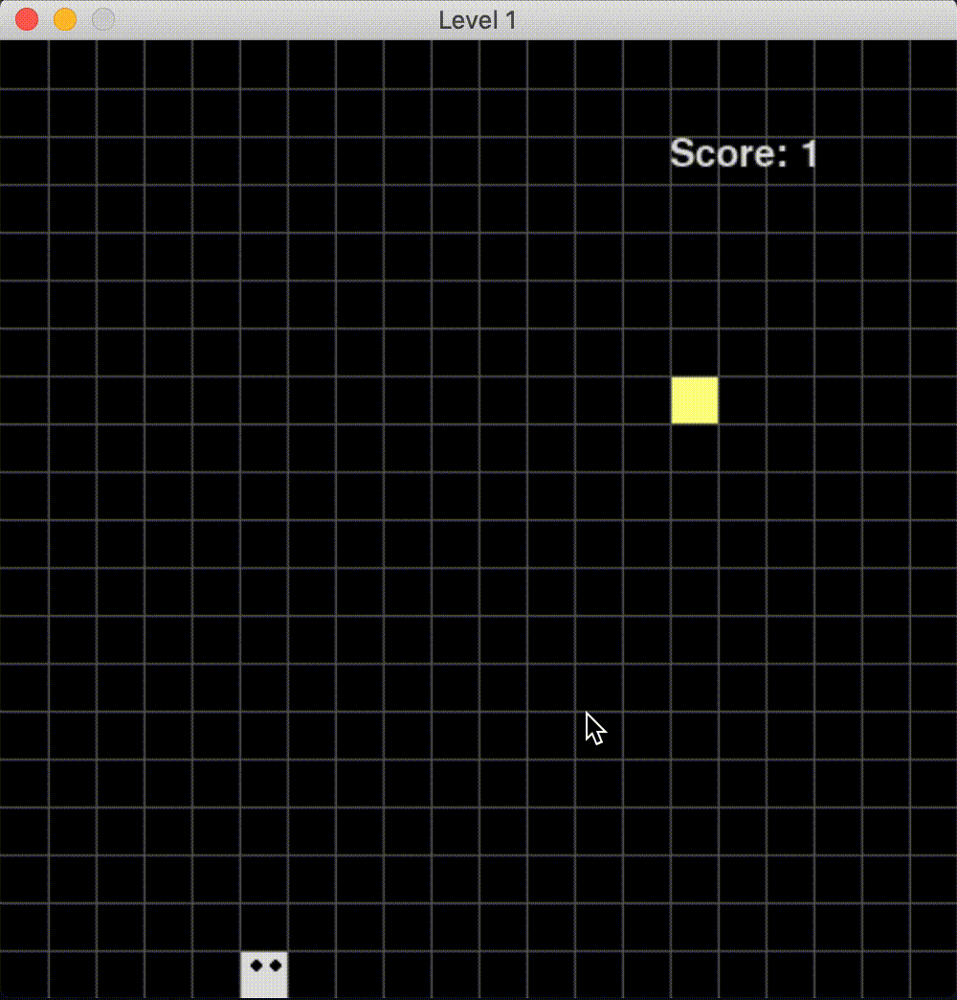
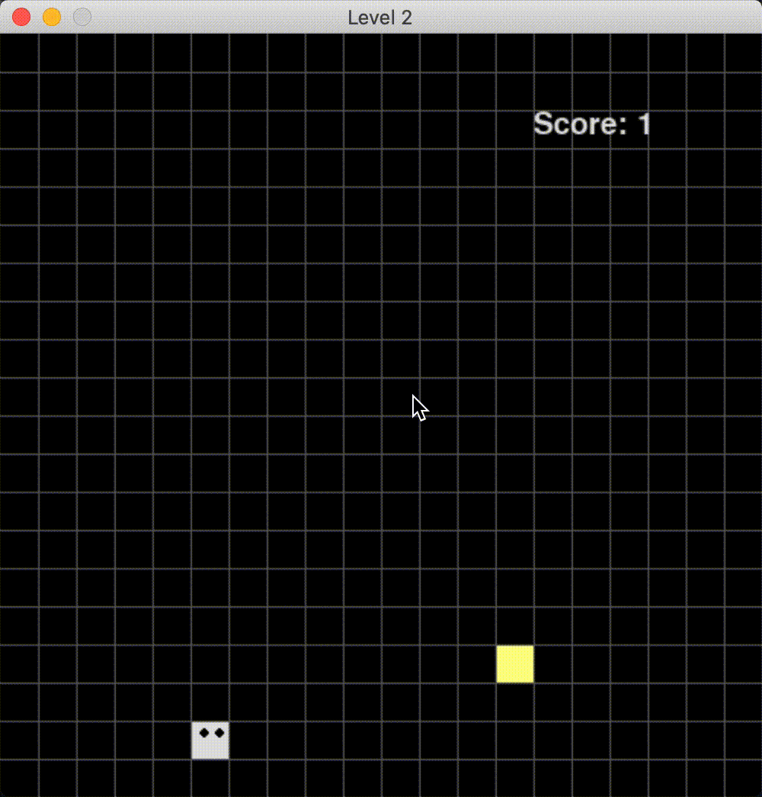
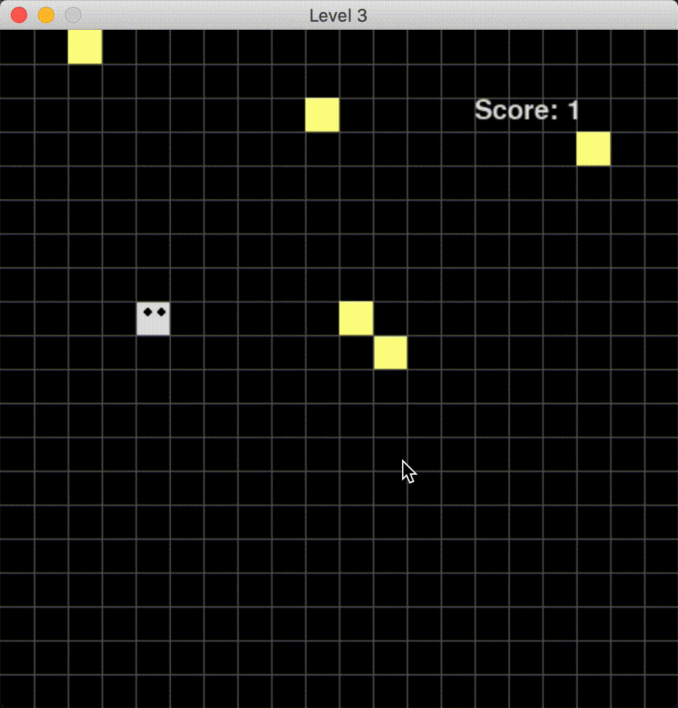

# Drunk Snake
* a simple snake game in python to practice object-oriented-programming

#### by [Siwei Ma](https://www.linkedin.com/in/siwei-ma-28345856/)

A classic snake game with extra difficulties. The snake is drunk with slow reaction, confused, and sometimes hallucinated :(

# How it looks

After running the main file, you will see the menu with three difficulties: *slow reaction*, *confusion* and *I'm fineeeeee*. 

> Menu

For *slow reaction* level, the snake's reaction is always five steps slower. You can modify `delay_countdown` in `game_level1.py` to change the reaction speed. To me, the snake game becomes a shooting game.

> Slow snake

For *confusion* level, all snake's response is opposite. The snake will go down when letting him go up. 

> Slow snake

For *I'm fineeeeee* level, the snake sees hallucinations. There are five apples (or called snacks) in his eye but only one is real.

> Snake with hallucinations

# Thank you for playing!
